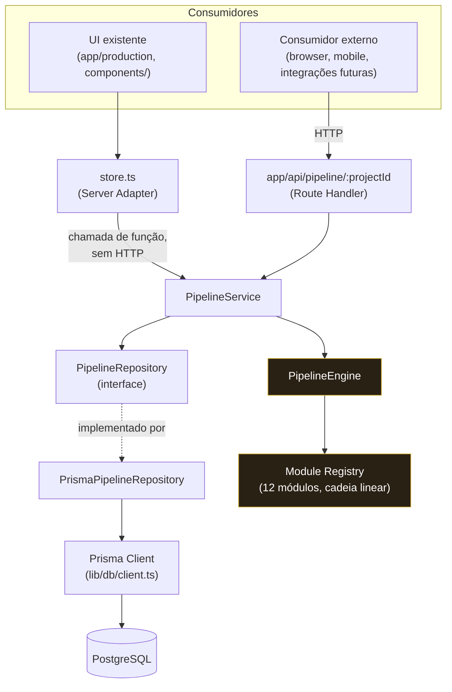
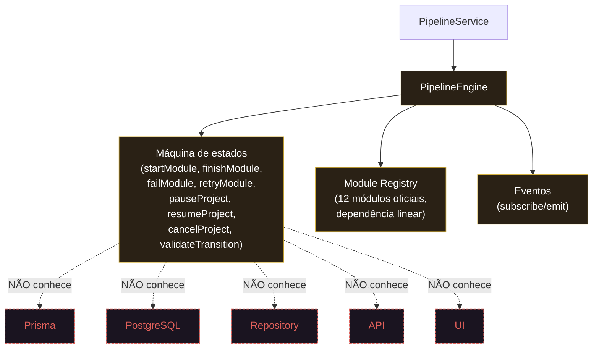
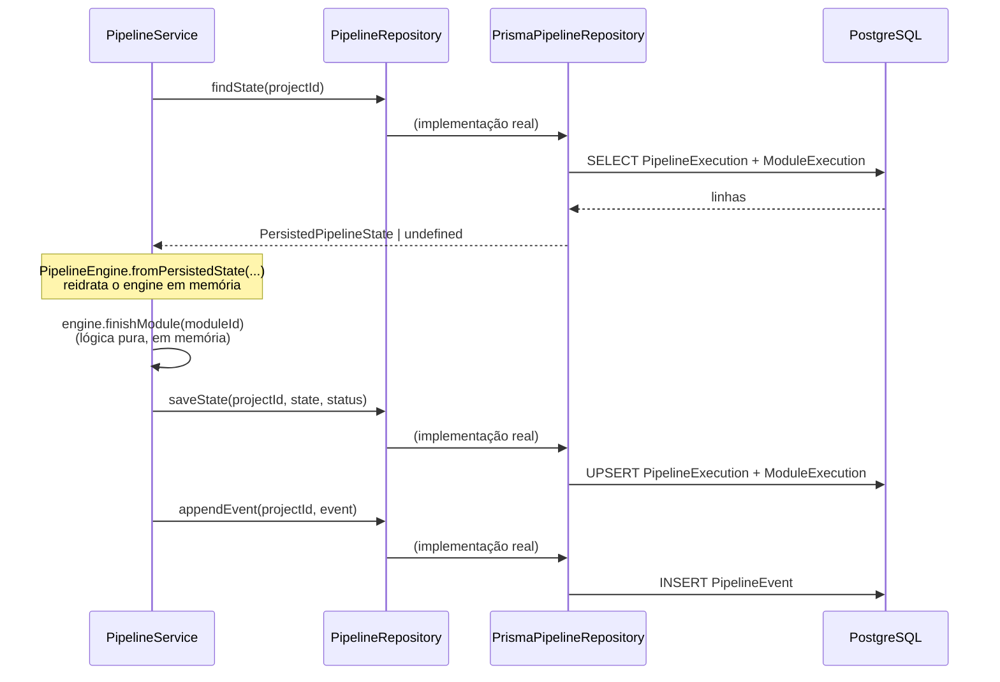

# Arquitetura do Sistema — AZ Raven Pipeline Core

> Este documento representa a arquitetura **real e atual** do Pipeline
> Core (Sprints 1.1–1.3), não um plano aspiracional. Ver os ADRs em
> `docs/architecture/adr/` para o raciocínio por trás de cada decisão, e
> `docs/architecture/dependency-rules.md` para as regras de dependência
> derivadas deste desenho.

## 1. Visão geral — os dois caminhos até o Pipeline Service

Existem **dois consumidores** do pipeline hoje, e os dois convergem no
mesmo `PipelineService` — nenhuma lógica de orquestração é duplicada
entre eles.

**Por que dois caminhos, uma única orquestração:** `store.ts` existe
porque um Server Component chamando sua própria rota de API via
`fetch()` é um round-trip de rede desnecessário (o próprio Next.js App
Router desaconselha isso). A API HTTP continua existindo, intacta, como
a única porta para consumidores que realmente estão fora do processo
Next.js.

## 2. Zoom — dentro do Pipeline Engine

O `PipelineEngine` (`lib/pipeline-core/engine.ts`) e o `Registry`
(`lib/pipeline-core/registry.ts`) são arquivos **congelados** desde a
Sprint 1.1 — nenhuma Task de persistência, API ou UI jamais os alterou.
Ver ADR-0001.

## 3. Fluxo de persistência, em detalhe

## 4. O que o Pipeline Engine explicitamente NÃO conhece

| Não conhece | Onde essa fronteira é garantida |
|---|---|
| Prisma | `engine.ts` nunca importa `@prisma/client`; único import de módulo externo em todo o arquivo é `./registry` e `./types` |
| Banco de dados | Nenhuma operação de I/O em `engine.ts` — puramente síncrono |
| Repository | `engine.ts` não importa nada de `lib/repositories/` |
| API | `engine.ts` não importa nada de `next/server` nem de `app/` |
| UI | `engine.ts` não importa nada de `app/`, `components/` ou React |

Todas as afirmações acima são verificadas automaticamente por
`tests/architecture/layer-boundaries.test.ts` a cada `npm test`.
